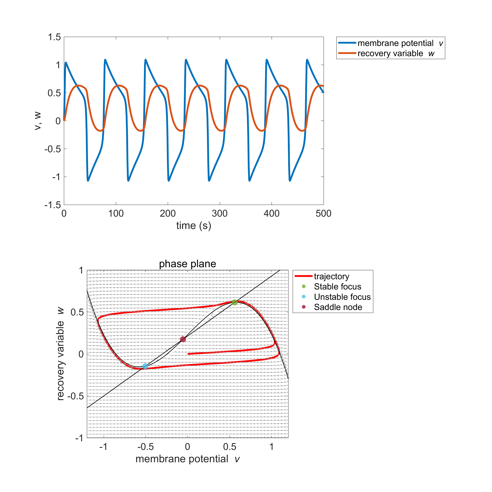

# Demo_FitzHughNagumo 
Sample of MATLAB implementation for stability analysis of Fitz-Hugh Nagumo model

# Example of the results
The code generating the following figure is found in ex2_phase_plane.m.

# Authors 
&ensp; Hiroshi Yokoyama 
&ensp;&ensp;(Division of Neural Dynamics, Department of System Neuroscience, National Institute for Physiological Sciences, Japan) 
